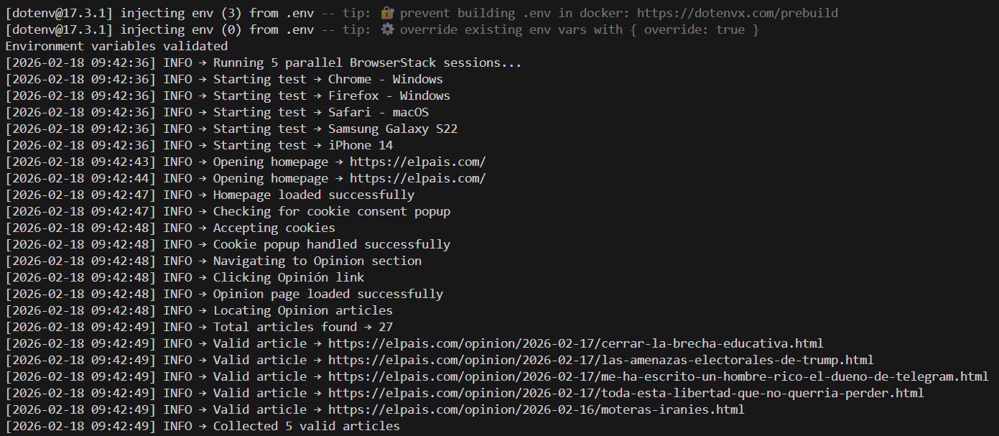
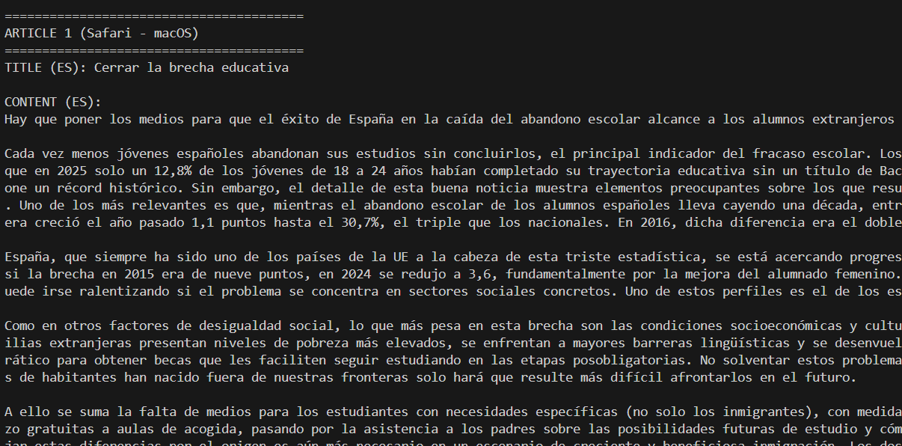
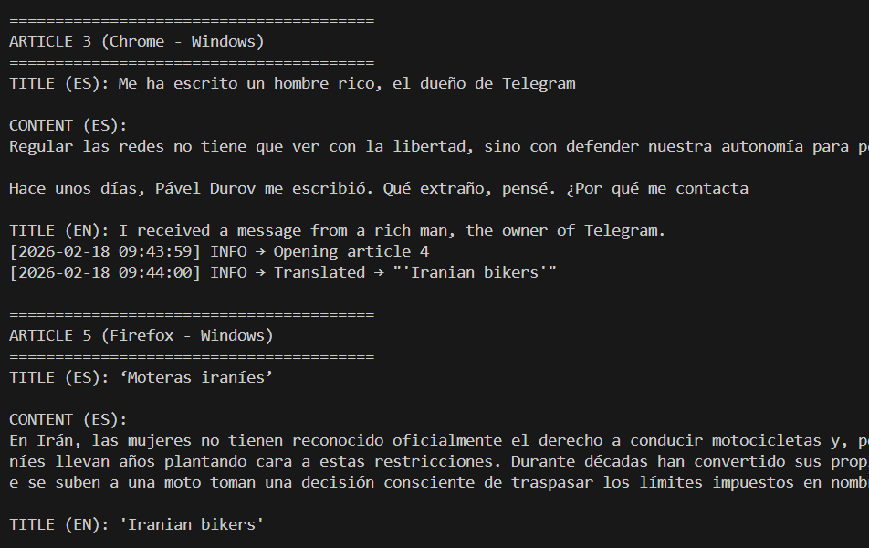
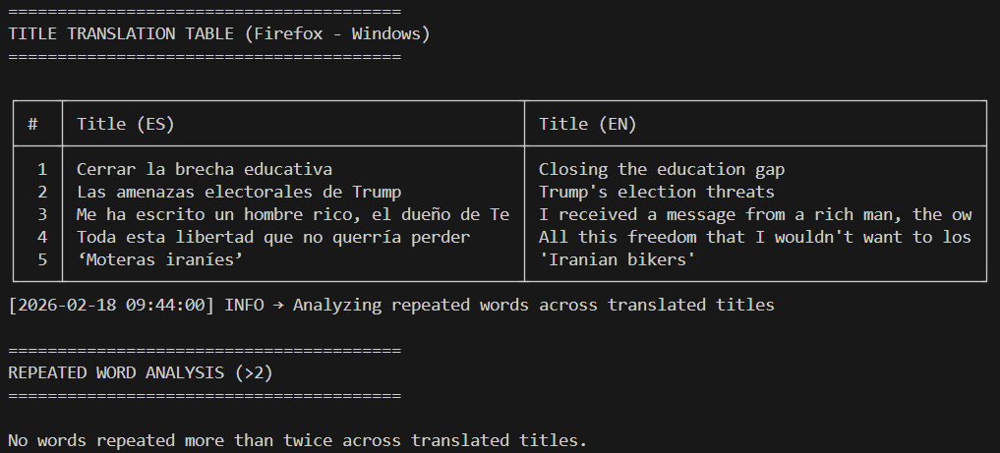
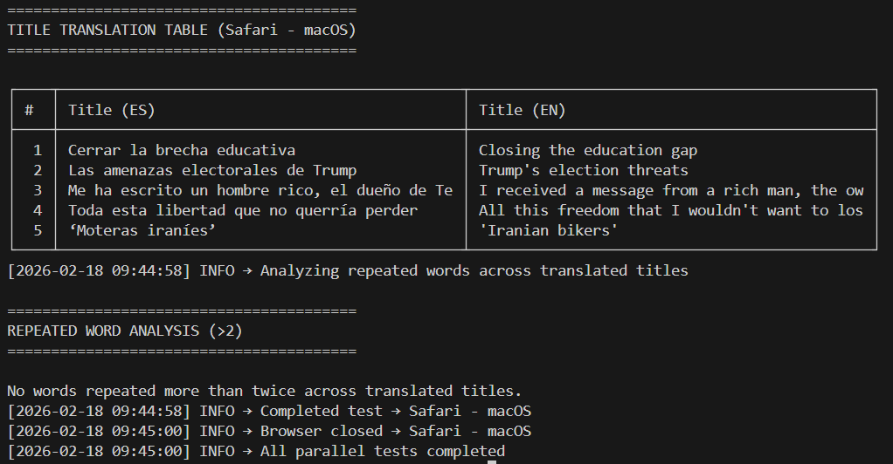
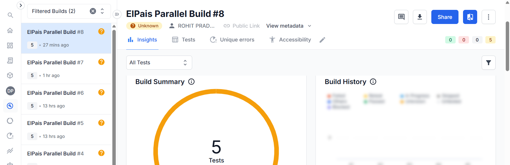

# 📰 EL PAÍS Opinion Automation & Cross-Browser Testing
<p align="center">
  
</p>
An end-to-end Selenium WebDriver automation framework built with **Node.js** that performs real-world website interaction, content extraction, API integration, and cloud-based cross-browser testing using **BrowserStack Automate**.

---

## 📌 Project Overview

This automation solution simulates a realistic QA / Customer Engineering workflow by:

- Navigating the **EL PAÍS** news website
- Extracting the latest **Opinion** articles
- Capturing:
  - Spanish Titles 🇪🇸
  - Article Content 📄
  - Cover Images 🖼
- Translating titles to English 🇬🇧
- Performing repeated word analysis
- Executing locally and on BrowserStack
- Running tests in **parallel across multiple browsers/devices**

---

## 🎯 Objectives

✔ Automate dynamic website interaction  
✔ Demonstrate Selenium WebDriver expertise  
✔ Implement robust DOM/content extraction  
✔ Integrate Translation API  
✔ Handle standard & gallery articles  
✔ Enable parallel execution  
✔ Perform post-processing data analysis  
✔ Validate cross-browser compatibility  

---

## 🧰 Tech Stack

- **Node.js**
- **Selenium WebDriver**
- **BrowserStack Automate**
- **RapidAPI – Google Translate**
- **JavaScript (ES6)**
- **dotenv**

---

## ⚙️ Key Functionalities

### ✅ Automated Website Navigation
- Opens EL PAÍS homepage
- Handles cookie consent popup
- Navigates to Opinion section

---

### ✅ Dynamic Article Detection
- Identifies latest Opinion articles
- Filters valid URLs based on:
  - `/opinion/`
  - Date pattern (`YYYY-MM-DD`)

---

### ✅ Robust Content Extraction

Supports:

✔ Standard Articles  
✔ Gallery / Photo Articles  

Extraction Strategy:

- Uses `.a_standfirst` (intro/summary)
- Falls back to meaningful paragraph blocks
- Avoids UI noise & metadata clutter

---

### ✅ Cover Image Extraction & Download
- Detects article cover images (`figure img`)
- Downloads locally into `/images`

---

### ✅ Title Translation (Spanish → English)
- Uses RapidAPI (Google Translate)
- Handles API response parsing & failures

---

### ✅ Repeated Word Analysis
- Processes translated titles
- Detects words repeated more than twice

---

### ✅ Structured Console Reporting

Outputs:

✔ Article details  
✔ Translation table  
✔ Word repetition analysis  
✔ Execution logs  

---

### ✅ BrowserStack Cloud Integration ☁️
- Executes on cloud browsers/devices
- Debugging enabled
- Captures:
  - Network logs
  - Console logs

---

### ✅ Parallel Execution 🚀
- Runs across 5 concurrent sessions
- Cross-browser / cross-device capable
- Dynamic session naming

---

## ☁️ Cloud Testing (BrowserStack)

### 🖥 Desktop Browsers
✔ Windows / macOS  
✔ Chrome / Firefox / Edge / Safari  

---

### 📱 Mobile Browsers

Mobile execution was initiated but not fully functional.

**Observed Issue:**
- Navigation to Opinion section failed
- EL PAÍS mobile layout uses a **hamburger menu**
- Desktop selectors were incompatible with responsive UI

**Key Takeaway:**

✔ Demonstrates real-world responsive testing challenge  
✔ Highlights importance of device-specific locators  
✔ Validates complexity of cross-device automation  

---

## ✨ Features at a Glance

✔ End-to-end Selenium WebDriver automation  
✔ Intelligent DOM/content extraction strategy  
✔ Standard & gallery article handling  
✔ API-driven title translation  
✔ Parallel cross-browser execution  
✔ BrowserStack cloud validation  
✔ Post-processing text analysis  

---

## 🛠 Troubleshooting

**Issue:** Cookie popup blocking navigation  
✔ **Solution:** Explicit wait & popup handling logic implemented  

**Issue:** Mobile navigation failure  
✔ **Cause:** Responsive layout using hamburger menu  
✔ **Resolution:** Requires device-specific locators  

**Issue:** Translation API failure  
✔ **Solution:** Implemented error handling & fallback logging  

---


## 📊 Sample Output

### 🔹 Parallel BrowserStack Execution
<p align="center">
  
</p>

### 🔹 Extracted Article Content

<p align="center">
  
</p>

### 🔹 Title Translation & Cross-Browser Output

<p align="center">
  
</p>

### 🔹 Title Translation Table & Word Analysis

<p align="center">
  
</p>

### 🔹 Final Execution & Test Completion

<p align="center">
  
</p>

### 🔹 BrowserStack Parallel Build Execution

<p align="center">
  
</p>

## 🚀 How to Run the Project

### ▶ Run Locally

**1. Install dependencies**
```bash
npm install
```

**2. Configure environment variables**
```env
BROWSERSTACK_USERNAME=your_username
BROWSERSTACK_ACCESS_KEY=your_access_key
RAPIDAPI_KEY=your_api_key
```

**3. Execute the automation**
```bash
node src/main.js
```

## 👨‍💻 Author

**Rohith Pradeep**

🎓 Final Year Computer Engineering Student  
🏫 Pillai College of Engineering  
🔗 LinkedIn: [linkedin.com/in/rohith-pradeep/](https://www.linkedin.com/in/rohith-pradeep/)
